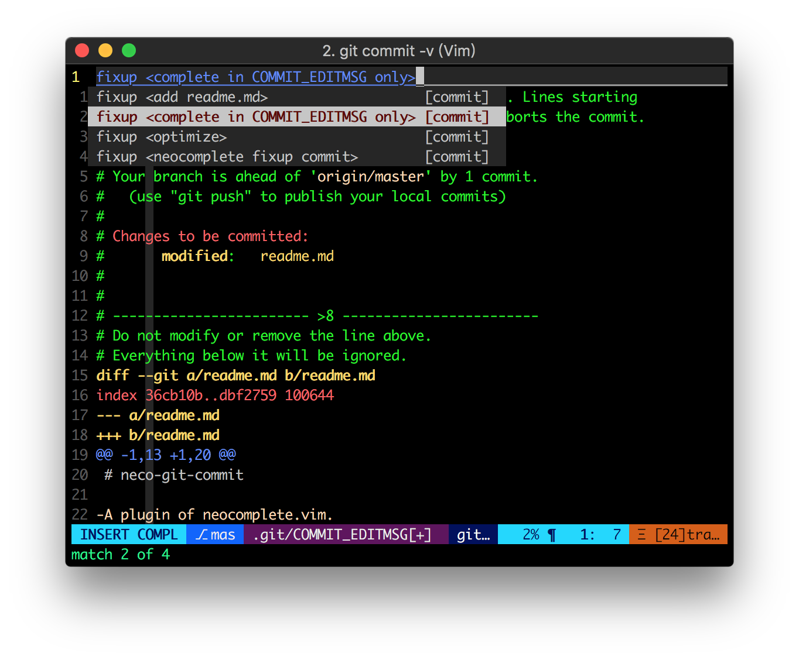

# neco-git-commit

A plugin of [neocomplete.vim](https://github.com/Shougo/neocomplete.vim).
Complete from commit history for editting commit-message.

## Installation

### Plug.vim

```viml
Plug 'Shougo/neocomplete.vim'
Plug 'uncelbill/neco-git-commit'
```
## usage

### fixup

type `fixup ` when editting commit-message.


